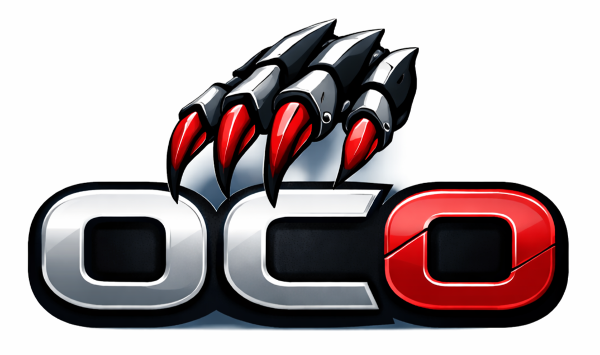

# oco: OpenClaw orchestrator

<p align="left">
  
</p>

A tool for managing OpenClaw agent organizations

## Use Cases
- Human-coupled agents: each human gets a dedicated agent/account boundary.
- Functional agents: dedicated agents for support, procurement, growth, research, etc.
- Isolation-first operations: separate state/workspaces/ports across instances.
- Shared governance: org-wide defaults with per-instance and per-agent overrides.

## Features
- Inventory-driven instance/agent orchestration with template + local workflows.
- Validation for collisions and misconfiguration (ports, paths, bindings).
- Layered OpenClaw config rendering from templates + instance overrides.
- Docker Compose generation and lifecycle commands per instance.
- Agent add/remove/list operations.
- Policy checks for integrations, skills, and models.
- Revision snapshots for update/rollback workflows.

## Prerequisites
- Node.js `25+`
- Bun `1.3+`
- Docker + Docker Compose

## Install
```bash
git clone https://github.com/maestro-org/oco.git
cd oco
bun install
bun run install:global
oco --help
```

If `oco` is not found:
```bash
echo 'export PATH="$HOME/.bun/bin:$PATH"' >> ~/.zshrc
```

## Quick Start

### 1. Create a local inventory (recommended)
Keep the tracked template for examples, and manage your real org config in an ignored file:
```bash
oco inventory init
```

This creates `inventory/instances.local.yaml` from the template.

Defaults:
- `oco` uses `inventory/instances.local.yaml` when it exists.
- Otherwise it falls back to `inventory/instances.yaml`.
- You can always override with `--inventory <path>` or `OCO_INVENTORY_PATH`.

### 2. Configure your organization inventory
Edit `inventory/instances.local.yaml` (or your chosen inventory path) for:
- `organization.org_id`, `organization.org_slug`, `organization.display_name`
- `instances[*].host.gateway_port`
- channel account mappings and `agents[*].bindings`
- policy allowlists under `defaults.policy` and `instances[*].policy`

Reference template:
- `inventory/instances.example.yaml`

### 3. Configure secrets
```bash
cp .env.example .env
```

Set required values in `.env`:
```dotenv
OPENCLAW_GATEWAY_TOKEN=<strong-random-token>
OPENAI_API_KEY=<provider-key>
BRAVE_API_KEY=<brave-search-api-key>
TELEGRAM_BOT_TOKEN_VBARSEGYAN=<telegram-bot-token>
TELEGRAM_BOT_TOKEN_DRICHARDSON=<telegram-bot-token>
DISCORD_BOT_TOKEN_BRAIN_QA=<discord-bot-token>
GITHUB_TOKEN=<github-token>
NOTION_API_KEY=<notion-token>
BETTERSTACK_API_TOKEN=<betterstack-token>
```

Load env:
```bash
set -a
source .env
set +a
```

### 4. Deploy
```bash
./scripts/deploy-instance.sh core-human
```

Manual equivalent:
```bash
oco validate
oco policy validate
oco render --instance core-human
oco compose generate --instance core-human
oco preflight --instance core-human
oco compose up --instance core-human
oco health --instance core-human
```

### 5. Pair Telegram users
```bash
oco pairing list --instance core-human --channel telegram --account drichardson --json
oco pairing approve --instance core-human --channel telegram --account drichardson --code <PAIRING_CODE>
```

### 6. Manage agents
```bash
oco agent list --instance core-human

oco agent add \
  --instance core-human \
  --agent-id support \
  --role usecase \
  --account telegram:support \
  --integration telegram \
  --model openai/gpt-4.1-mini \
  --soul-template operations \
  --tools-template operations

oco soul list
oco soul apply --instance core-human --agent-id drichardson --template business-development --force
oco tools list
oco tools apply --instance core-human --agent-id drichardson --template business-development --force

oco compose up --instance core-human
```

### 7. Maestro Discord Functional Rollout
Recommended secure grouping:
- `maestro-discord-knowledge`: `brain-qa`, `deep-research`
- `maestro-discord-systems`: `github-manager`, `notion-manager`
- `maestro-discord-infra`: `infra-triage`

If you use `inventory/instances.local.yaml`, merge these new instances there.
Or run commands with `--inventory inventory/instances.yaml`.

Deploy:
```bash
INVENTORY_PATH=inventory/instances.yaml ./scripts/deploy-instance.sh maestro-discord-knowledge
INVENTORY_PATH=inventory/instances.yaml ./scripts/deploy-instance.sh maestro-discord-systems
INVENTORY_PATH=inventory/instances.yaml ./scripts/deploy-instance.sh maestro-discord-infra
```

Apply dedicated templates:
```bash
oco --inventory inventory/instances.yaml soul apply --instance maestro-discord-knowledge --agent-id brain-qa --template brain-qa --force
oco --inventory inventory/instances.yaml tools apply --instance maestro-discord-knowledge --agent-id brain-qa --template brain-qa --force
```

## Documentation
- Deployment runbook: `docs/DEPLOYMENT_RUNBOOK.md`
- Bot access setup (Telegram + Discord): `docs/BOT_ACCESS_SETUP.md`
- End-to-end Telegram walkthrough: `docs/E2E_OCO_TELEGRAM.md`
- End-to-end Maestro Discord walkthrough: `docs/E2E_OCO_DISCORD_MAESTRO.md`
- Configuration reference: `docs/CONFIGURATION_DETAILS.md`
- Integrations and use cases: `docs/INTEGRATIONS_AND_USE_CASES.md`
- Data source convention: `docs/DATA_SOURCES_CONVENTION.md`
- SOUL template workflow: `docs/SOUL_TEMPLATES.md`
- TOOLS template workflow: `docs/TOOLS_TEMPLATES.md`
- Product requirements: `docs/REQUIREMENTS.md`

## Skills
- Repo skills live under `skills/<skill-name>/`.
- Each skill should include `SKILL.md`; optional UI metadata belongs in `agents/openai.yaml`.
- Included skill: `skills/thoughtful-oco-facilitator/`
- Invocation pattern: reference `$thoughtful-oco-facilitator` in the request.

## Open Source Safety
- Keep real secrets only in local `.env` (ignored by default).
- Do not commit runtime state or rendered configs from `instances/*/state` and `instances/*/config/openclaw.json5*`.
- Run this before pushing:

```bash
git status --short --ignored
rg -n "sk-[A-Za-z0-9]{20,}|ghp_[A-Za-z0-9]{20,}|BEGIN (RSA|EC|OPENSSH|PGP|DSA)? ?PRIVATE KEY" .
```

## TODO
- [ ] Dashboard UI
  - [ ] Model provider usage and analytics integration
- [ ] Kubernetes deployments
- [ ] SSO OAuth sec layer
- [ ] Email integration
- [ ] Architecture diagram doc
- [ ] Multi-org management
- [ ] Update to latest OC version

## License
MIT (`LICENSE`)
