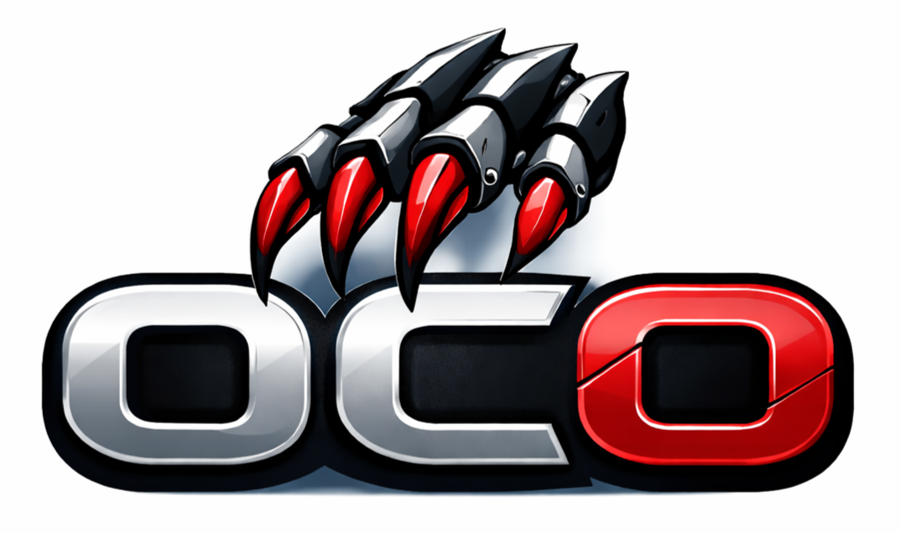

# OpenClaw Orchestrator

<p align="center">
  
</p>

<p align="center">
  <a href="https://github.com/maestro-org/oco/actions/workflows/ci.yml" target="_blank"></a>
  <a href="https://www.npmjs.com/package/@maestro-org/oco" target="_blank"></a>
  <a href="https://codecov.io/gh/maestro-org/oco" target="_blank"></a>
  <a href="https://discord.gg/SJgkEje7" target="_blank"></a>
  <a href="./LICENSE" target="_blank"></a>
</p>

Manage OpenClaw organizations with inventory-driven configuration, isolated runtime boundaries, and repeatable deployment workflows.

## Features
- Multi-instance orchestration from a single inventory.
- Strict isolation across config/state/workspaces per instance.
- Org-level deployment provider selection (`docker` or `kubernetes`) with env overrides.
- Policy guardrails for models, skills, and integrations.
- Agent lifecycle commands (add/remove/list) with channel bindings.
- Template workflows for `SOUL.md` and `TOOLS.md`.
- Render/runtime/deploy workflows with revision support.

## Integrations
- Channels: Telegram, Discord.
- Tool/API workflows: GitHub, Notion, Better Stack, web search (Brave), Google Calendar (via `gws`).

See `docs/INTEGRATIONS_AND_USE_CASES.md` for details.

## Source Layout
- `src/`: OCO core orchestration modules and admin API server implementation.
- `dashboard/`: React + Vite admin dashboard client.

## Quick Start

### Install
Global install (recommended):
```bash
npm install -g @maestro-org/oco
oco --help
```

Run without installing globally:
```bash
npx @maestro-org/oco --help
```

If `oco` is not found:
```bash
echo 'export PATH="$(npm config get prefix)/bin:$PATH"' >> ~/.zshrc
```

### Initialize Inventory
```bash
oco inventory init
# or: npx @maestro-org/oco inventory init
```

When installed from npm, `oco inventory init` uses the bundled inventory template if no local template file exists yet.

Edit `inventory/instances.local.yaml` (recommended) for:
- organization metadata
- organization deployment target (`organization.deployment.provider`)
- instance ports and paths
- channel accounts + agent bindings
- policy allow/deny defaults

For isolated multi-org setups, use one inventory per org:
- `inventory/<org>.instances.local.yaml` (local, gitignored), or
- `inventory/<org>.instances.yaml` (tracked template/reference).

A generic multi-org example is available at `inventory/org.instances.example.yaml`.

Path resolution order:
1. `--inventory <path>`
2. `OCO_INVENTORY_PATH`
3. `inventory/instances.local.yaml`
4. `inventory/instances.yaml`

### Configure Secrets
```bash
cp .env.example .env
```

Typical values:
```dotenv
OPENCLAW_GATEWAY_TOKEN=<strong-random-token>
OPENAI_API_KEY=<provider-key>

TELEGRAM_BOT_TOKEN_OWNER=<telegram-bot-token>
DISCORD_BOT_TOKEN_BRAIN_QA=<discord-bot-token>

GITHUB_TOKEN=<github-token>
NOTION_API_KEY=<notion-token>
BETTERSTACK_API_TOKEN=<betterstack-token>
BETTERSTACK_API_BASE_URL=<betterstack-api-base-url>
```

Load env:
```bash
set -a
source .env
set +a
```

For multi-org isolation, keep secrets in separate files (for example `.env.acme`, `.env.beta-org`) and load via:
```bash
ORG_ENV_FILE=.env.acme ./scripts/org.sh acme validate
```

### Choose Deployment Target
Set the org default in inventory:
```yaml
organization:
  deployment:
    provider: docker # or kubernetes
    kubernetes:
      namespace: default
      # context omitted => current kubectl context
```

When Kubernetes names are omitted, `oco` defaults deployment/service/container names to `oco-<instance-id>`.

Optional env overrides:
- `OCO_DEPLOYMENT_PROVIDER=docker|kubernetes`
- `OCO_KUBE_CONTEXT=<context>`
- `OCO_KUBE_NAMESPACE=<namespace>`
- `OCO_KUBECONFIG=<path>`

Inspect the resolved target:
```bash
oco deployment target --instance core-human
```

### Validate and Deploy
```bash
oco validate
oco policy validate
oco preflight --instance core-human

./scripts/deploy-instance.sh core-human
oco health --instance core-human
```

`oco compose ...` and `oco runtime ...` are provider-aware and automatically use Docker Compose or Kubernetes based on org config/env.

### Manage Agents and Templates
```bash
oco agent list --instance core-human

oco agent add \
  --instance core-human \
  --agent-id support \
  --role usecase \
  --account telegram:support \
  --integration telegram \
  --model openai/gpt-5.1 \
  --soul-template operations \
  --tools-template operations
```

Apply templates to an existing agent:
```bash
oco soul apply --instance core-human --agent-id support --template operations --force
oco tools apply --instance core-human --agent-id support --template operations --force
```

Run org-scoped commands with the helper script:
```bash
./scripts/org.sh <org> validate
./scripts/org.sh <org> runtime up --instance <instance-id>
./scripts/org.sh <org> health --instance <instance-id>
```

### Admin API (Phase 1 Foundation)
Start the dashboard API backend:
```bash
oco admin api serve --host 127.0.0.1 --port 4180 --db-path .generated/admin/dashboard.sqlite
```

Open dashboard UI:
- `http://127.0.0.1:4180/admin`

Default login credentials:
- username: `admin`
- password: `admin`

Override via env:
```bash
OCO_ADMIN_USERNAME=<user>
OCO_ADMIN_PASSWORD=<password>
OCO_ADMIN_MASTER_KEY=<encryption-key>
OCO_OPENAI_MONTHLY_LIMIT_USD=<optional-limit>
OCO_ANTHROPIC_MONTHLY_LIMIT_USD=<optional-limit>
```

Current API coverage includes:
- onboarding validate/commit routes for organizations and agents
- organization/instance/agent CRUD and overview
- organization settings + inventory import/export routes
- provider key management (encrypted + redacted)
- usage event ingestion + provider/model/agent usage summaries
- runtime render/deploy/restart/health endpoints (inventory-backed bridge)

Dashboard client stack:
- React 18
- Vite 5 (`base=/admin/` so built assets are served by the API under `/admin`)

### One-Command Stack
Bring up orchestration runtime + admin dashboard API:
```bash
oco stack up
```

Tear down:
```bash
oco stack down
```

Inspect status:
```bash
oco stack status
```

Use `--provider docker|kubernetes` to force provider resolution and `--dry-run` to preview actions.

### Local Dashboard Dev
Start the API in watch mode:
```bash
oco dev up
oco dev logs --lines 200
```

Run the dashboard client with Vite hot reload:
```bash
bun run dashboard:dev
```

Build dashboard assets for API static serving:
```bash
bun run dashboard:build
```

Stop API dev mode:
```bash
oco dev down
```

## Recommended Functional Isolation
Group by credential risk and write scope. For example:
- `discord-knowledge`: read-heavy QA/research agents.
- `discord-systems`: write-capable system-of-record agents (GitHub/Notion).
- `discord-infra`: monitoring + incident triage agents.

Detailed rollout: `docs/E2E_OCO_DISCORD_FUNCTIONAL_AGENTS.md`

## Documentation
Comprehensive documentation is available in `docs/`, including deployment steps, usage examples, and reusable templates.

For the admin dashboard + API build plan, see `docs/ADMIN_DASHBOARD_IMPLEMENTATION_PLAN.md`.

For Google Calendar rollout via `gws`, see `docs/GOOGLE_CALENDAR_GWS_ROLLOUT.md`.

## Security Best Practices
- Keep secrets in local `.env` only.
- Do not commit runtime state or rendered configs.
- Run before pushing:

```bash
git status --short --ignored
rg -n "sk-[A-Za-z0-9]{20,}|ghp_[A-Za-z0-9]{20,}|BEGIN (RSA|EC|OPENSSH|PGP|DSA)? ?PRIVATE KEY" .
```
